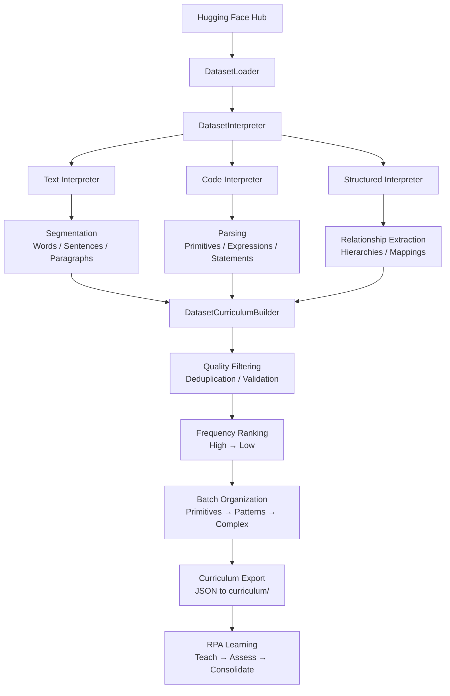

I have created the following plan after thorough exploration and analysis of the codebase. Follow the below plan verbatim. Trust the files and references. Do not re-verify what's written in the plan. Explore only when absolutely necessary. First implement all the proposed file changes and then I'll review all the changes together at the end.

# Recursive Pattern Agent (RPA) — Pragmatic Scaling & Enhancement Plan

## Observations

You have a working skeleton implementation on another platform that successfully stores and retrieves patterns but lacks depth in self-assessment, proactive inquiry, and correction-based learning loops. The architecture is sound (STM/LTM/episodic memory, pattern graphs, hierarchy levels), but the "intelligence" components need substantial fleshing out. The consolidation logic is opaque (21/50 words passing), gap detection is stubbed, and there are no tests. The real opportunity is to scale curriculum complexity (words → sentences → code snippets), enhance recursive linking, and make the learning feedback loops genuinely operational.

## Approach

Rather than redesigning, this plan focuses on **pragmatic enhancement** of the existing skeleton. The strategy is: (1) make consolidation transparent with detailed validation reporting, (2) implement sophisticated self-assessment with measurable criteria, (3) build real gap detection and proactive inquiry, (4) add comprehensive tests, (5) scale curriculum complexity progressively, (6) enhance recursive pattern linking, (7) prepare the API layer for external agent integration. Work is organized into three phases: **Foundation Hardening** (weeks 1-2), **Intelligence Deepening** (weeks 3-4), and **Scaling & Integration** (weeks 5-6).

---

## Phase 1: Foundation Hardening (Weeks 1-2)

### 1.1 Consolidation Transparency & Validation Reporting

**File**: `rpa/validation/consolidation_reporter.py`

- Implement `ConsolidationReporter` class with detailed validation breakdown:
  - `report_consolidation(batch_id, session_id) -> dict` — returns:
    ```python
    {
      "batch_id": "english_batch_2",
      "total_patterns": 50,
      "consolidated": 21,
      "rejected": 15,
      "pending_review": 14,
      "breakdown": {
        "structural_valid": 21,
        "missing_references": 8,
        "circular_dependencies": 3,
        "incomplete_composition": 4,
        "other_issues": 0
      },
      "details": [
        {
          "node_id": "word:apple",
          "status": "consolidated",
          "issues": []
        },
        {
          "node_id": "word:xyz",
          "status": "rejected",
          "issues": ["missing child node: primitive:z"]
        }
      ]
    }
    ```
  - `identify_rejection_patterns(batch_id) -> dict` — groups rejections by issue type
  - `suggest_fixes(node_id) -> List[str]` — recommends how to fix a rejected pattern

**File**: `rpa/validation/validator.py` (extend)

- Add `validate_pattern_structure_detailed(node_id, ltm) -> dict` that returns:
  - `is_valid: bool`
  - `structural_issues: List[dict]` — each with `issue_type`, `description`, `affected_nodes`
  - `missing_references: List[str]` — node IDs that don't exist
  - `circular_deps: List[List[str]]` — cycles in the graph
  - `composition_depth: int` — how many levels deep the pattern is composed
  - `all_children_resolved: bool` — all child references exist

### 1.2 Enhanced Self-Assessment with Measurable Criteria

**File**: `rpa/assessment/criteria.py` (new)

- Define `AssessmentCriteria` dataclass:
  ```python
  @dataclass
  class AssessmentCriteria:
      pattern_id: str
      criteria: List[dict]  # [{"type": "reconstruct", "weight": 0.4}, ...]
      required_pass_rate: float  # 0.8 = 80% of exercises must pass
      structural_validation_required: bool
      recursive_depth_check: bool
  ```

**File**: `rpa/assessment/engine.py` (extend)

- Enhance `SelfAssessmentEngine.assess_pattern()`:
  - Generate 5-10 exercises (not 3-5) covering:
    - **Reconstruction**: generate output, compare to expected
    - **Recognition**: given output, identify pattern
    - **Composition**: given components, compose pattern
    - **Decomposition**: given pattern, identify components
    - **Recursive recall**: given pattern, traverse and verify all children exist
  - Score each exercise: `{"exercise_id": str, "type": str, "passed": bool, "expected": str, "generated": str, "issues": List[str]}`
  - Return detailed assessment:
    ```python
    {
      "node_id": str,
      "is_valid": bool,
      "exercises": List[dict],
      "pass_rate": float,  # 0.0-1.0
      "structural_issues": List[str],
      "recursive_depth": int,
      "all_children_resolved": bool,
      "assessment_summary": str  # human-readable
    }
    ```

### 1.3 Comprehensive Test Suite

**File**: `tests/test_core_graph.py`

- Test `PatternGraph`:
  - Node creation and retrieval
  - Edge creation and ordering
  - Circular dependency detection
  - Traversal correctness
  - Hierarchy level calculation

**File**: `tests/test_memory_layers.py`

- Test `ShortTermMemory`, `LongTermMemory`, `EpisodicMemory`:
  - Pattern creation in STM
  - Consolidation to LTM
  - Event logging
  - Session isolation

**File**: `tests/test_assessment.py`

- Test `SelfAssessmentEngine`:
  - Exercise generation
  - Scoring logic
  - Structural validation
  - Detailed reporting

**File**: `tests/test_validation.py`

- Test `Validator`:
  - Structural validation
  - Issue detection
  - Fix suggestions

**File**: `tests/test_consolidation.py`

- Test `ConsolidationReporter`:
  - Rejection pattern identification
  - Detailed breakdown
  - Fix recommendations

**File**: `tests/fixtures.py`

- Provide reusable test data:
  - Sample primitives (a, b, c, ...)
  - Sample patterns (apple, cat, dog, ...)
  - Sample sentences
  - Sample code snippets

---

## Phase 2: Intelligence Deepening (Weeks 3-4)

### 2.1 Sophisticated Gap Detection

**File**: `rpa/inquiry/gap_detector.py` (rewrite)

- Implement `GapDetector` with multiple detection strategies:
  - `detect_flagged_uncertain_patterns(ltm) -> List[Node]` — patterns marked `is_uncertain=True`
  - `detect_incomplete_composition(ltm) -> List[dict]` — patterns with missing child references
    - Returns: `[{"node_id": str, "missing_children": List[str], "severity": "high"|"medium"|"low"}]`
  - `detect_orphaned_patterns(ltm) -> List[Node]` — patterns not referenced by higher-level patterns
  - `detect_unresolved_references(ltm) -> List[dict]` — edges pointing to non-existent nodes
  - `detect_hierarchy_gaps(ltm, domain) -> List[dict]` — missing intermediate levels
    - Example: primitives exist, words exist, but no sentence patterns
  - `detect_cross_domain_gaps(ltm) -> List[dict]` — patterns in one domain that could link to another
    - Example: "if" (code) could link to "conditional" (English concept)
  - `prioritize_gaps(gaps: List[dict]) -> List[dict]` — rank by impact and frequency

### 2.2 Intelligent Question Generation

**File**: `rpa/inquiry/question_generator.py` (enhance)

- Extend `QuestionGenerator` with context-aware questions:
  - `generate_composition_question(node_id, missing_children) -> str`
    - Example: "I learned 'apple' from a, p, p, l, e. But I'm missing the connection to 'p'. Can you clarify?"
  - `generate_usage_question(node_id, orphaned_status) -> str`
    - Example: "I know the word 'apple'. How is it used in sentences?"
  - `generate_hierarchy_question(domain, missing_level) -> str`
    - Example: "I know letters and words in English. What comes between them?"
  - `generate_cross_domain_question(node_id_1, domain_1, node_id_2, domain_2) -> str`
    - Example: "I know 'if' in Python. How does it relate to 'conditional' in English?"
  - `generate_batch_questions(batch_id, ltm, gap_priorities) -> List[dict]`
    - Returns: `[{"inquiry_id": str, "question": str, "type": str, "gap_type": str, "priority": "high"|"medium"|"low"}]`

### 2.3 Learning from User Answers

**File**: `rpa/learning/answer_integrator.py` (new)

- Implement `AnswerIntegrator` to process inquiry responses:
  - `integrate_composition_answer(inquiry_id, response, node_id, stm, ltm) -> dict`
    - Parses response to identify missing children
    - Creates new edges or nodes as needed
    - Returns: `{"new_nodes": List[str], "new_edges": List[str], "pattern_updated": bool}`
  - `integrate_usage_answer(inquiry_id, response, node_id, stm, ltm) -> dict`
    - Identifies higher-level patterns mentioned in response
    - Creates `FOLLOWS` or `IS_INSTANCE_OF` edges
  - `integrate_hierarchy_answer(inquiry_id, response, domain, stm, ltm) -> dict`
    - Creates intermediate pattern nodes
    - Links them to existing primitives and higher-level patterns
  - `integrate_cross_domain_answer(inquiry_id, response, node_id_1, node_id_2, stm, ltm) -> dict`
    - Creates cross-domain edges (e.g., `CLARIFIES`, `EXPANDS`)
  - `validate_integrated_pattern(node_id, ltm) -> dict` — re-validates after integration

### 2.4 Correction Feedback Loop

**File**: `rpa/learning/correction_analyzer.py` (new)

- Implement `CorrectionAnalyzer`:
  - `analyze_correction(wrong_node_id, correct_node_id, feedback, ltm) -> dict`
    - Identifies what was wrong (structural, compositional, usage)
    - Suggests pattern refinements
    - Returns: `{"issue_type": str, "root_cause": str, "suggested_fixes": List[str]}`
  - `apply_correction_insights(wrong_node_id, correct_node_id, ltm) -> dict`
    - Updates related patterns to avoid similar errors
    - Marks similar patterns for review
    - Returns: `{"patterns_updated": List[str], "patterns_flagged": List[str]}`

---

## Phase 3: Scaling & Integration (Weeks 5-6)

### 3.1 Curriculum Complexity Scaling

**File**: `curriculum/english/batch_2_words_enhanced.json`

- Expand from 50 to 200+ high-frequency words
- Add metadata:
  ```json
  {
    "lesson_id": "en_2_001",
    "content": "apple",
    "type": "pattern",
    "hierarchy_level": 1,
    "composition": ["a", "p", "p", "l", "e"],
    "usage_contexts": ["fruit", "food", "noun"],
    "related_patterns": ["apples", "apple_tree"],
    "difficulty": 1,
    "frequency": "high"
  }
  ```

### 3.1a Dataset-Driven Curriculum Generation

**File**: `rpa/preprocessing/dataset_loader.py` (new)

- Implement `DatasetLoader` to ingest Hugging Face datasets:
  - `load_huggingface_dataset(dataset_name: str, split: str = "train") -> Dataset` — loads dataset from HF Hub
  - `load_local_dataset(path: str, format: str) -> Dataset` — loads local datasets (CSV, JSON, Parquet)
  - `validate_dataset_schema(dataset: Dataset, required_fields: List[str]) -> bool` — ensures dataset has required columns
  - Supported formats: text, code, structured (CSV), unstructured (JSON)

**File**: `rpa/preprocessing/dataset_interpreter.py` (new)

- Implement `DatasetInterpreter` to convert datasets into curriculum:
  - `interpret_text_dataset(dataset: Dataset, domain: str, batch_config: dict) -> List[dict]`
    - Extracts text samples from dataset
    - Segments by hierarchy (words, sentences, paragraphs)
    - Deduplicates and filters by frequency/quality
    - Returns annotated sequences ready for curriculum packaging
  - `interpret_code_dataset(dataset: Dataset, language: str, batch_config: dict) -> List[dict]`
    - Extracts code snippets from dataset
    - Parses into primitives (keywords, operators, literals)
    - Segments by complexity (expressions, statements, functions)
    - Returns annotated code patterns
  - `interpret_structured_dataset(dataset: Dataset, domain: str, batch_config: dict) -> List[dict]`
    - Extracts key-value pairs, relationships, hierarchies
    - Maps to pattern composition
    - Returns structured patterns
  - `filter_by_quality(sequences: List[dict], min_length: int, max_length: int, language: str) -> List[dict]`
    - Removes duplicates, malformed entries, non-UTF8
    - Validates against domain-specific rules
  - `rank_by_frequency(sequences: List[dict]) -> List[dict]`
    - Sorts by occurrence in dataset
    - Prioritizes high-frequency patterns for early learning

**File**: `rpa/preprocessing/dataset_curriculum_builder.py` (new)

- Implement `DatasetCurriculumBuilder` to create batches from interpreted data:
  - `build_curriculum_from_dataset(dataset_name: str, domain: str, num_batches: int, batch_size: int) -> List[dict]`
    - Loads dataset via `DatasetLoader`
    - Interprets via `DatasetInterpreter`
    - Organizes into progressive batches (primitives → patterns → complex)
    - Returns list of curriculum batch dicts
  - `create_batch(sequences: List[dict], batch_id: str, hierarchy_level: int, difficulty: int) -> dict`
    - Packages sequences into a lesson batch
    - Adds success metrics based on hierarchy level
    - Returns curriculum batch JSON
  - `validate_curriculum_progression(batches: List[dict]) -> dict`
    - Ensures each batch builds on previous
    - Checks for gaps in hierarchy
    - Returns: `{"is_valid": bool, "issues": List[str], "recommendations": List[str]}`
  - `export_curriculum(batches: List[dict], output_dir: str) -> List[str]`
    - Saves batches to `curriculum/<domain>/` directory
    - Returns list of exported file paths

**File**: `rpa/preprocessing/dataset_config.py` (new)

- Define dataset interpretation configurations:
  ```python
  @dataclass
  class DatasetConfig:
      dataset_name: str  # e.g., "wikitext", "openwebtext", "code_search_net"
      domain: str  # "english", "python", "javascript"
      split: str  # "train", "validation", "test"
      text_field: str  # column name containing text/code
      metadata_fields: List[str]  # optional: category, language, etc.
      min_length: int  # minimum sequence length
      max_length: int  # maximum sequence length
      sample_size: int  # number of samples to use (None = all)
      deduplication: bool  # remove duplicates
      language_filter: str  # filter by language (for multilingual datasets)
      quality_threshold: float  # 0.0-1.0, filter low-quality samples
  ```

**File**: `rpa/preprocessing/dataset_examples.py` (new)

- Provide pre-configured dataset interpretations:
  ```python
  DATASET_CONFIGS = {
      "english_wikitext": DatasetConfig(
          dataset_name="wikitext",
          domain="english",
          split="train",
          text_field="text",
          min_length=10,
          max_length=500,
          sample_size=10000,
          deduplication=True,
          quality_threshold=0.8
      ),
      "python_code_search_net": DatasetConfig(
          dataset_name="code_search_net",
          domain="python",
          split="train",
          text_field="code",
          min_length=5,
          max_length=200,
          sample_size=5000,
          deduplication=True,
          quality_threshold=0.9
      ),
      "english_common_voice": DatasetConfig(
          dataset_name="common_voice",
          domain="english",
          split="train",
          text_field="sentence",
          min_length=5,
          max_length=100,
          sample_size=5000,
          language_filter="en",
          deduplication=True
      )
  }
  ```

**File**: `curriculum/english/batch_3_sentences_new.json`

- Create 100+ simple sentences with explicit structure (auto-generated from datasets):
  ```json
  {
    "lesson_id": "en_3_001",
    "content": "The cat sat.",
    "type": "pattern",
    "hierarchy_level": 2,
    "composition": ["the", "cat", "sat"],
    "structure": {
      "subject": "cat",
      "verb": "sat",
      "article": "the"
    },
    "related_patterns": ["The dog sat.", "The cat ran."],
    "difficulty": 2,
    "frequency": "high",
    "source_dataset": "wikitext",
    "dataset_frequency": 1250
  }
  ```

**File**: `curriculum/coding/batch_2_python_patterns_enhanced.json`

- Expand Python patterns with explicit composition (auto-generated from datasets):
  ```json
  {
    "lesson_id": "py_2_001",
    "content": "x = 5",
    "type": "pattern",
    "hierarchy_level": 1,
    "composition": ["x", "=", "5"],
    "pattern_type": "assignment",
    "related_patterns": ["y = 10", "name = 'Alice'"],
    "difficulty": 1,
    "frequency": "high",
    "source_dataset": "code_search_net",
    "dataset_frequency": 8750
  }
  ```

**File**: `curriculum/coding/batch_3_code_snippets_new.json`

- Add code snippet patterns (3-5 lines, auto-generated from datasets):
  ```json
  {
    "lesson_id": "py_3_001",
    "content": "for i in range(5):\n    print(i)",
    "type": "pattern",
    "hierarchy_level": 2,
    "composition": ["for", "i", "in", "range", "(", "5", ")", ":", "print", "(", "i", ")"],
    "structure": {
      "loop_type": "for",
      "variable": "i",
      "range": "5",
      "body": "print(i)"
    },
    "related_patterns": ["for i in range(10):", "for item in list:"],
    "difficulty": 2,
    "frequency": "high",
    "source_dataset": "code_search_net",
    "dataset_frequency": 3420
  }
  ```

### 3.2 Enhanced Recursive Pattern Linking

**File**: `rpa/learning/recursive_linker.py` (new)

- Implement `RecursiveLinker`:
  - `link_pattern_hierarchy(node_id, ltm) -> dict` — creates explicit links between hierarchy levels
    - Links primitives → words → sentences → paragraphs
    - Links code primitives → expressions → statements → functions
  - `identify_compound_patterns(ltm, domain) -> List[dict]` — finds patterns that can be composed
    - Example: "apple" + "tree" → "apple tree"
  - `create_compound_pattern(component_ids, compound_label, ltm) -> Node` — creates new pattern from components
  - `verify_recursive_integrity(node_id, ltm) -> dict` — ensures all levels are properly linked
    - Returns: `{"is_valid": bool, "missing_links": List[str], "orphaned_nodes": List[str]}`

### 3.3 Enhanced Practice & Exercise Loop

**File**: `rpa/assessment/exercise_generator.py` (enhance)

- Expand exercise types:
  - **Reconstruction**: generate output from pattern
  - **Recognition**: identify pattern from output
  - **Composition**: compose pattern from components
  - **Decomposition**: decompose pattern into components
  - **Recursive recall**: traverse and verify all children
  - **Contextual usage**: use pattern in a sentence or code snippet
  - **Error detection**: identify and fix errors in a pattern
  - **Analogy**: find similar patterns in same or different domain
  - **Transformation**: transform pattern (e.g., singular → plural, lowercase → uppercase)

**File**: `rpa/assessment/exercise_scorer.py` (new)

- Implement `ExerciseScorer`:
  - `score_exercise(exercise, response, ltm) -> dict`
    - Returns: `{"is_correct": bool, "score": 0.0-1.0, "feedback": str, "issues": List[str]}`
  - `aggregate_exercise_scores(exercises: List[dict]) -> dict`
    - Returns: `{"overall_score": float, "by_type": dict, "strengths": List[str], "weaknesses": List[str]}`

### 3.4 API Layer for External Agent Integration

**File**: `rpa/api/agent_interface.py` (new)

- Implement `AgentInterface` for external agents:
  ```python
  class AgentInterface:
      def query_pattern(self, label: str, domain: str) -> dict
      def teach_pattern(self, content: str, domain: str, hierarchy_level: int) -> dict
      def assess_pattern(self, label: str, domain: str) -> dict
      def get_inquiries(self, domain: str = None) -> List[dict]
      def answer_inquiry(self, inquiry_id: str, response: str) -> dict
      def get_curriculum_status(self) -> dict
      def get_memory_status(self) -> dict
  ```

**File**: `rpa/api/rest_server.py` (new)

- Implement REST API using Flask or FastAPI:
  - `GET /pattern/<label>/<domain>` — query pattern
  - `POST /pattern` — teach pattern
  - `GET /pattern/<label>/<domain>/assess` — assess pattern
  - `GET /inquiries` — get pending inquiries
  - `POST /inquiries/<inquiry_id>/answer` — answer inquiry
  - `GET /status/curriculum` — curriculum status
  - `GET /status/memory` — memory status

**File**: `rpa/api/websocket_server.py` (new)

- Implement WebSocket server for real-time interaction:
  - Agents can subscribe to inquiry events
  - Agents can push answers in real-time
  - Agents can stream pattern learning

---

## Implementation Roadmap

### Week 1: Foundation Hardening
- [ ] Implement `ConsolidationReporter` with detailed validation breakdown
- [ ] Enhance `SelfAssessmentEngine` with 5-10 exercises and measurable criteria
- [ ] Create comprehensive test suite (core, memory, assessment, validation, consolidation)
- [ ] Document why 21/50 words consolidated (run reporter on existing data)

### Week 2: Foundation Hardening (continued)
- [ ] Fix any issues identified by tests
- [ ] Achieve 80%+ test coverage on core modules
- [ ] Create test fixtures and sample data
- [ ] Document test results and coverage

### Week 3: Intelligence Deepening
- [ ] Implement sophisticated `GapDetector` with 6 detection strategies
- [ ] Enhance `QuestionGenerator` with context-aware questions
- [ ] Implement `AnswerIntegrator` to learn from user responses
- [ ] Test gap detection and question generation on existing curriculum

### Week 4: Intelligence Deepening (continued)
- [ ] Implement `CorrectionAnalyzer` for correction feedback loop
- [ ] Create end-to-end test: teach → assess → identify gaps → ask questions → integrate answers
- [ ] Document learning loop effectiveness
- [ ] Refine question generation based on test results

### Week 5: Scaling & Integration
- [ ] Expand English curriculum (batch 2: 200+ words, batch 3: 100+ sentences)
- [ ] Expand Python curriculum (batch 2: patterns, batch 3: code snippets)
- [ ] Implement `RecursiveLinker` for hierarchy linking
- [ ] Enhance exercise generator with 9 exercise types

### Week 6: Scaling & Integration (continued)
- [ ] Implement `ExerciseScorer` with detailed feedback
- [ ] Implement `AgentInterface` for external agent integration
- [ ] Implement REST API server
- [ ] Implement WebSocket server for real-time interaction
- [ ] End-to-end testing with external agent simulation

### Week 7: Dataset-Driven Curriculum (NEW)
- [ ] Implement `DatasetLoader` to ingest Hugging Face datasets
- [ ] Implement `DatasetInterpreter` for text, code, and structured data
- [ ] Create pre-configured dataset interpretations (wikitext, code_search_net, common_voice)
- [ ] Test dataset loading and interpretation on 3-5 datasets

### Week 8: Dataset-Driven Curriculum (continued)
- [ ] Implement `DatasetCurriculumBuilder` to create batches from datasets
- [ ] Auto-generate English curriculum from wikitext (1000+ words, 500+ sentences)
- [ ] Auto-generate Python curriculum from code_search_net (500+ patterns, 200+ snippets)
- [ ] Validate curriculum progression and quality
- [ ] Export auto-generated curricula to `curriculum/` directory

---

## Success Metrics

| Metric | Target | Current |
|--------|--------|---------|
| Consolidation transparency | 100% of rejections explained | Unknown |
| Self-assessment coverage | 9 exercise types | 3-5 |
| Gap detection strategies | 6 types | 0 (stubbed) |
| Test coverage | 80%+ | 0% |
| Curriculum complexity | Words → Sentences → Code snippets | Words only |
| Recursive linking | All hierarchy levels linked | Partial |
| Learning from answers | Integrated into LTM | Minimal |
| API readiness | REST + WebSocket | None |
| Dataset integration | 5+ datasets supported | 0 |
| Auto-generated curriculum | 1000+ words, 500+ sentences, 500+ code patterns | 0 |
| Dataset quality filtering | 90%+ valid patterns | N/A |
| Curriculum progression validation | 100% of batches validated | N/A |

---

## Key Deliverables

1. **Consolidation Transparency**: Detailed reports explaining why patterns pass/fail
2. **Enhanced Self-Assessment**: 5-10 exercises per pattern with measurable criteria
3. **Comprehensive Tests**: 80%+ coverage with fixtures and sample data
4. **Sophisticated Gap Detection**: 6 detection strategies with prioritization
5. **Intelligent Inquiry**: Context-aware questions based on gap type
6. **Learning Loop**: Integrate user answers into LTM with validation
7. **Correction Feedback**: Analyze corrections and refine related patterns
8. **Scaled Curriculum**: 200+ words, 100+ sentences, code snippets
9. **Recursive Linking**: All hierarchy levels properly connected
10. **API Layer**: REST + WebSocket for external agent integration
11. **Dataset Integration**: Load and interpret Hugging Face datasets
12. **Auto-Generated Curriculum**: 1000+ words, 500+ sentences, 500+ code patterns from real datasets
13. **Quality Filtering**: Deduplication, validation, frequency-based ranking
14. **Curriculum Validation**: Ensure progression and completeness across batches

---

## Technical Notes

- **No breaking changes**: All enhancements are additive; existing code remains functional
- **Backward compatible**: New fields in Node/Edge are optional with sensible defaults
- **Incremental testing**: Each component tested independently before integration
- **Documentation**: Each module includes docstrings, examples, and test cases
- **Performance**: Optimize graph traversal and validation for 1000+ patterns
- **Dataset caching**: Cache downloaded datasets locally to avoid repeated downloads
- **Streaming support**: Process large datasets in batches to minimize memory usage
- **Deduplication**: Use hashing to efficiently remove duplicate patterns
- **Quality metrics**: Track dataset quality scores and filter by threshold

---

## Dataset Integration Architecture



---

## Why This Approach Works

1. **Builds on existing skeleton**: Doesn't redesign, just deepens
2. **Addresses identified gaps**: Consolidation transparency, gap detection, learning loops
3. **Pragmatic scaling**: Curriculum complexity increases gradually
4. **Testable**: Each component has clear success criteria
5. **Agent-ready**: API layer prepared for external integration
6. **Measurable progress**: Weekly deliverables with clear metrics
7. **Data-driven learning**: Leverage massive, curated datasets from Hugging Face
8. **Scalable curriculum**: Auto-generate curricula for any domain with available datasets
9. **Quality assured**: Filter, deduplicate, and rank patterns by frequency
10. **Extensible**: Easy to add new dataset types and interpretation strategies
