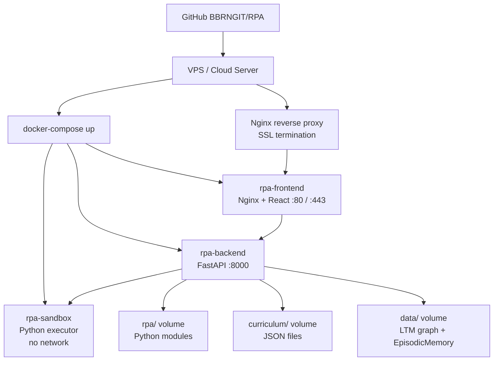

# Production Deployment Plan — RPA Full Stack

## Overview

Deploy the current Phase 8 full-stack build from `github.com/BBRNGIT/RPA` to a live production environment while development continues in parallel. The system is already functional — training pipeline, sandbox execution, multi-agent coordination, and the web UI are all present. Deployment is Docker-first. Development continues on the same repo via feature branches; production is updated by pulling and restarting containers.

---

## Current State (What's Already Built)

| Component | Status |
|---|---|
| Training pipeline (`train.py`) | ✅ Working — MBPP, HumanEval, WikiText, SQuAD, LeetCode, CodeSearchNet |
| STM → LTM consolidation | ✅ Working — 405 tests passing |
| Sandbox code execution | ✅ Working — Python sandbox |
| Multi-agent framework | ✅ Working — CodingAgent, LanguageAgent, Orchestrator |
| REST + WebSocket API (`rpa/api/`) | ✅ Designed, partially implemented |
| Web UI | ✅ Demo exists (Phase 8 in repo) |
| Docker / docker-compose | ⚠ Needs verification / finalization |
| Cloud hosting | ❌ Not yet deployed |

---

## Deployment Architecture



---

## Step-by-Step Deployment

### Step 1 — Verify Docker Compose locally

Before touching any server, confirm the full stack runs cleanly on your local machine from the repo.

**What to check:**
- `docker-compose.yml` exists at repo root and defines all three services: `rpa-backend`, `rpa-frontend`, `rpa-sandbox`
- `rpa-backend` Dockerfile installs all Python dependencies from `requirements.txt`
- `rpa-frontend` Dockerfile builds the React app and serves via Nginx
- `rpa-sandbox` Dockerfile is network-isolated (`network_mode: none` or equivalent)
- Volume mounts for `rpa/`, `curriculum/`, and `data/` (LTM persistence) are defined
- `docker-compose up` starts all services without errors
- `http://localhost:3000` loads the web UI
- `http://localhost:8000/docs` loads the FastAPI Swagger UI

**Gaps to fix if missing:**
- If `docker-compose.yml` doesn't exist → create it based on the Tech Plan service map
- If `requirements.txt` is incomplete → generate from current environment (`pip freeze`)
- If LTM data isn't persisted → add a named volume for the graph database file

---

### Step 2 — Choose a hosting provider

Docker-first means any Linux VPS works. Recommended for simplicity and cost:

| Provider | Spec | Est. Cost | Notes |
|---|---|---|---|
| **Hetzner CX22** | 2 vCPU, 4GB RAM, 40GB SSD | ~€4/mo | Best value, EU-based |
| **DigitalOcean Droplet** | 2 vCPU, 4GB RAM | ~$24/mo | Simple UI, good docs |
| **Linode/Akamai** | 2 vCPU, 4GB RAM | ~$18/mo | Reliable |
| **AWS EC2 t3.medium** | 2 vCPU, 4GB RAM | ~$30/mo | More complex, more scalable |

**Minimum spec:** 2 vCPU, 4GB RAM, 20GB SSD. The RPA system is CPU-light (pattern graph operations) but needs RAM for the LTM graph and training runs.

---

### Step 3 — Server setup

On a fresh Ubuntu 22.04 LTS server:

1. Install Docker and Docker Compose
2. Install Nginx (for SSL termination and reverse proxy)
3. Install Certbot (for free SSL via Let's Encrypt)
4. Create a non-root deploy user with Docker group access
5. Open firewall ports: 22 (SSH), 80 (HTTP), 443 (HTTPS)
6. Point your domain (or subdomain) DNS A record to the server IP

---

### Step 4 — Deploy from GitHub

```
git clone https://github.com/BBRNGIT/RPA.git /opt/rpa
cd /opt/rpa
docker-compose up -d --build
```

This pulls the repo, builds all images, and starts all services in the background.

**Persistent data:** The LTM graph, EpisodicMemory, and curriculum files must be stored in Docker named volumes (not inside containers) so they survive container restarts and updates.

---

### Step 5 — Configure Nginx + SSL

Nginx sits in front of the stack and handles:
- Serving the React frontend on port 80/443
- Reverse-proxying `/api/*` to FastAPI on port 8000
- Reverse-proxying `/ws/*` to FastAPI WebSocket on port 8000
- SSL termination via Let's Encrypt (Certbot auto-renews)

**Domain structure:**
```
https://yourdomain.com          → React frontend
https://yourdomain.com/api/     → FastAPI REST
https://yourdomain.com/ws/      → WebSocket (dashboard live feed)
https://yourdomain.com/api/docs → Swagger UI (dev access)
```

---

### Step 6 — Continuous deployment (dev continues in parallel)

Development continues on feature branches. Production is updated by:

```
cd /opt/rpa
git pull origin main
docker-compose up -d --build
```

This rebuilds only changed images and restarts affected services with zero-downtime for the frontend (Nginx keeps serving while backend restarts).

**Recommended:** Add a simple deploy script (`deploy.sh`) to the repo that runs these two commands. Trigger it manually or via a GitHub Actions workflow on merge to `main`.

---

### Step 7 — Environment variables & secrets

The following must be set as environment variables on the server (not committed to git):

| Variable | Purpose |
|---|---|
| `HUGGINGFACE_TOKEN` | HF API access for dataset streaming |
| `SECRET_KEY` | FastAPI session signing |
| `ALLOWED_ORIGINS` | CORS whitelist for the frontend domain |
| `LTM_DATA_PATH` | Path to persistent LTM graph file |
| `SANDBOX_TIMEOUT` | Max seconds for code execution (default: 5) |

Store these in a `.env` file on the server (not in the repo). Docker Compose reads `.env` automatically.

---

### Step 8 — Health checks & monitoring

Add basic health monitoring from day one:

| Check | How |
|---|---|
| Backend alive | `GET /api/status` returns 200 — add to Nginx health check |
| Frontend alive | Nginx serves index.html — standard HTTP check |
| LTM integrity | `GET /api/status` includes `ltm_pattern_count` — alert if drops to 0 |
| Container restarts | `docker-compose` restart policy: `unless-stopped` on all services |
| Disk space | LTM graph grows over time — monitor `/opt/rpa/data/` volume |

For lightweight uptime monitoring: **UptimeRobot** (free tier) pings `GET /api/status` every 5 minutes and alerts on failure.

---

## What Users Can Do on Day 1

Once deployed, users can immediately:

| Action | How |
|---|---|
| Chat with the AI | Type queries in the chat panel |
| Submit code for execution | Paste code blocks — runs in sandbox |
| Use slash commands | `/train mbpp 10`, `/assess`, `/gaps`, `/status` |
| Rate AI responses | ✅ Correct / ❌ Wrong / ⚠ Incomplete buttons |
| Watch live training | Dashboard WebSocket feed shows real-time outcomes |
| View knowledge gaps | Gaps tab lists current inquiry queue |

---

## What Comes Next (Dev Continues in Parallel)

| Feature | Status |
|---|---|
| Intelligence engine (OutcomeEvaluator, PatternMutator, RetryEngine) | 🔨 In development |
| Standardized curriculum tracks + exam engine | 🔨 In development |
| Badge / certification system | 🔨 In development |
| IQ score calculator | 🔨 In development |
| Abstraction compression | 🔨 In development |

Each feature is deployed to production by merging to `main` and running `deploy.sh`. Users see improvements in real time as the AI gets smarter.

---

## Deployment Checklist

- [ ] `docker-compose.yml` verified locally — all 3 services start
- [ ] LTM data volume persists across container restarts
- [ ] VPS provisioned (Ubuntu 22.04, 2 vCPU, 4GB RAM minimum)
- [ ] Docker + Docker Compose installed on server
- [ ] Repo cloned to `/opt/rpa`
- [ ] `.env` file created with all required secrets
- [ ] `docker-compose up -d --build` runs successfully
- [ ] Nginx configured with reverse proxy rules
- [ ] SSL certificate issued via Certbot
- [ ] Domain DNS pointing to server IP
- [ ] `GET /api/status` returns 200 from public URL
- [ ] Web UI loads at `https://yourdomain.com`
- [ ] UptimeRobot monitoring configured
- [ ] `deploy.sh` script committed to repo