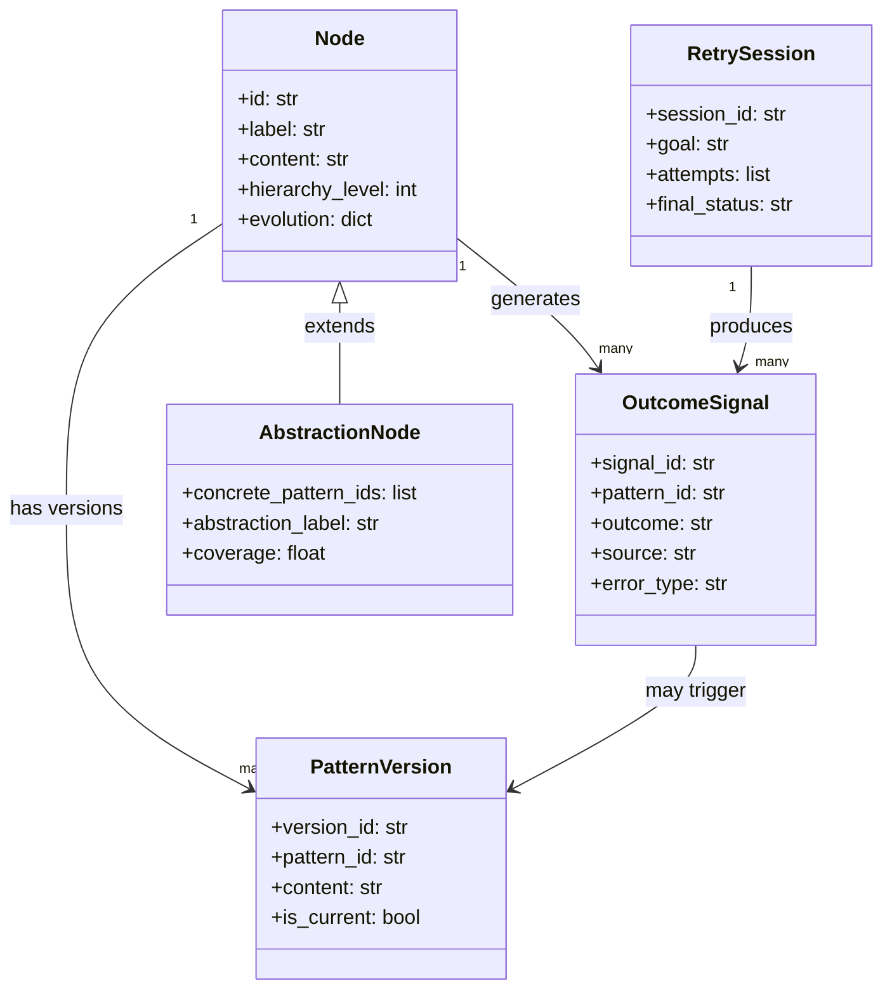
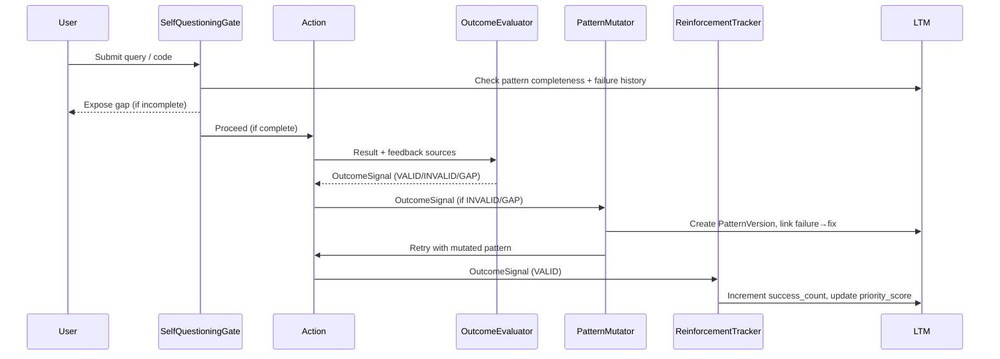
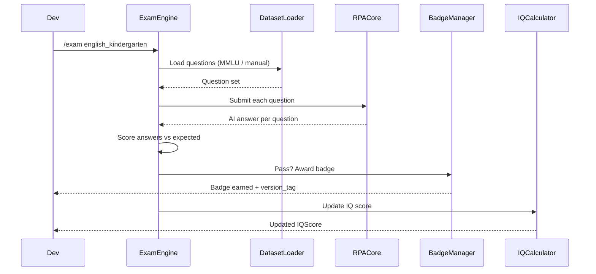
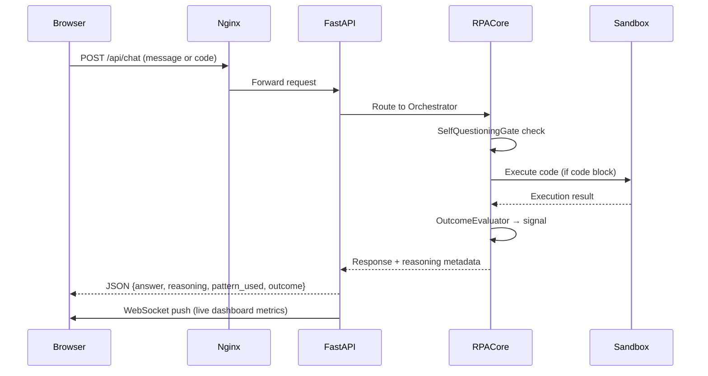
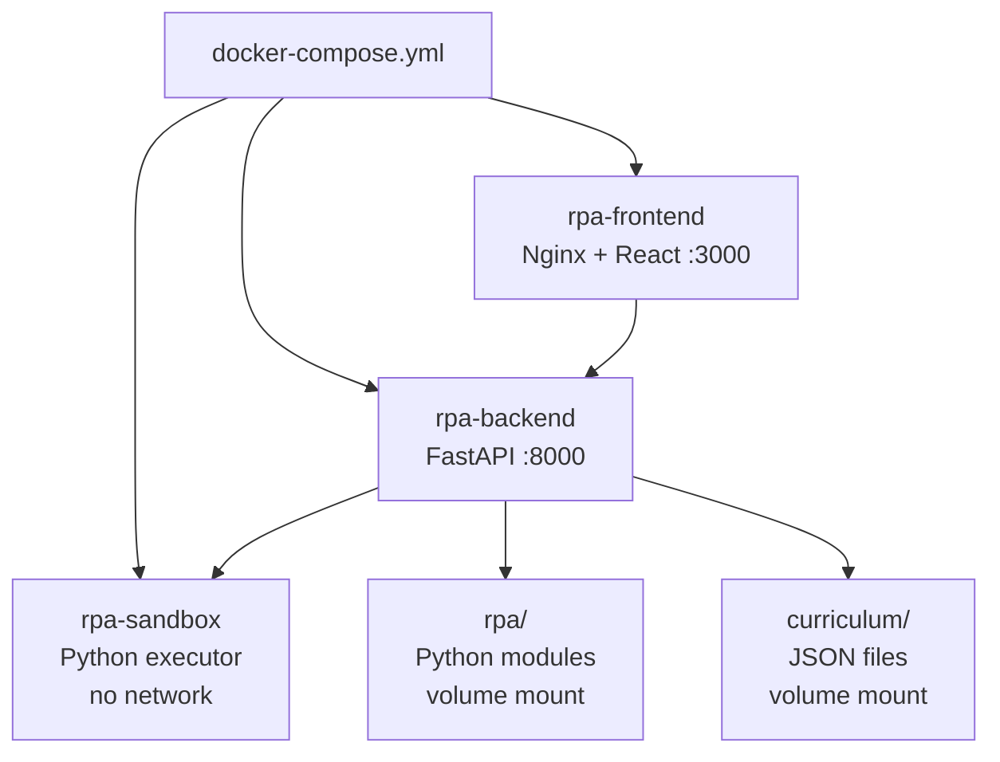

# Tech Plan — RPA Intelligence Engine & Web Interface

## 1. Architectural Approach

### Key Decisions

**Decision 1 — Intelligence engine as a pipeline, not a monolith.**
The closed-loop learning system is structured as an ordered pipeline of discrete, single-responsibility modules. Each module receives a well-defined input and produces a well-defined output. This means any stage can be tested, replaced, or bypassed independently. The pipeline is: `Action → OutcomeEvaluator → PatternMutator → ReinforcementTracker → MemoryEvolution`. The `SelfQuestioningGate` sits *before* output, not inside the pipeline.

**Decision 2 — Extend existing modules; add new ones for new concepts.**
The existing plan already defines `ReinforcementTracker`, `PatternVersioning`, `AbstractionEngine`, `ErrorClassifier`, and `ErrorCorrector` as planned modules. These are implemented as new files. The existing `LongTermMemory`, `EpisodicMemory`, and `Node` are *extended* with new fields (`usage_frequency`, `versions`, `failures`, `fixes`, `origin`) — not replaced. No breaking changes.

**Decision 3 — Feedback is multi-source, merged into a single `OutcomeSignal`.**
Three feedback sources (sandbox execution result, user explicit rating, `SelfAssessmentEngine` internal score) are normalized into a single `OutcomeSignal` struct before entering the pipeline. This keeps the pipeline clean — it doesn't need to know where feedback came from, only what the outcome was.

**Decision 4 — FastAPI backend, React frontend, WebSocket for live data.**
The existing plan already specifies `rpa/api/rest_server.py` and `rpa/api/websocket_server.py`. FastAPI is the natural choice (Python-native, async, auto-generates OpenAPI docs). The React frontend connects to REST for queries/commands and WebSocket for live dashboard streaming. This matches the Open WebUI pattern exactly.

**Decision 5 — Docker Compose as the single deployment unit.**
One `docker-compose.yml` defines three services: `rpa-backend` (FastAPI), `rpa-frontend` (React served via Nginx), and `rpa-sandbox` (isolated Python execution container). The sandbox is a separate container to enforce network isolation for code execution. Local and cloud deployment use the same compose file.

**Decision 6 — Deterministic reinforcement, no ML weights.**
All reinforcement is integer counters and boolean flags stored directly on `Node` metadata. `success_count`, `failure_count`, `usage_count`, `is_flagged`, `is_deprecated`. No probability distributions. Decay is time-based: a pattern unused for N days has its `priority_score` decremented by a fixed integer. This is auditable and reversible.

### Constraints
- No breaking changes to existing `Node`, `Edge`, `PatternGraph` interfaces — all new fields are optional with defaults
- The sandbox container must have no network access (security constraint)
- The retry engine must have a hard cap (max 5 retries) to prevent infinite loops — the existing `LoopDetector` enforces this
- **User/Dev boundary is enforced at the API layer** — all training, curriculum, exam, dashboard, and gap endpoints require dev authentication. End-user endpoints are unauthenticated (chat only).
- **End users never trigger explicit training** — learning from user interactions flows through the `OutcomeEvaluator` pipeline silently, not through any user-facing control
- **Two frontend route groups** — `/app/*` (end-user, public) and `/dev/*` (dev interface, auth-protected). Same React build, different route guards.

---

## 2. Data Model

### Extended `Node` (existing, extended)
The existing `Node` gains an `evolution` metadata block. All fields are optional with sensible defaults so existing patterns are unaffected.

```
Node.evolution = {
  "origin": str,           # dataset name or "user_taught" or "self_generated"
  "created_at": timestamp,
  "versions": [            # list of PatternVersion refs
    {"version_id": str, "reason": str, "timestamp": timestamp}
  ],
  "failures": [            # list of OutcomeSignal refs where outcome=INVALID
    {"signal_id": str, "error_type": str, "timestamp": timestamp}
  ],
  "fixes": [               # list of corrections applied
    {"fix_id": str, "fix_type": str, "timestamp": timestamp}
  ],
  "usage_count": int,      # total times pattern was used
  "success_count": int,    # times outcome=VALID
  "failure_count": int,    # times outcome=INVALID
  "last_used": timestamp,
  "priority_score": int,   # reinforcement score, decays with disuse
  "is_flagged": bool,      # flagged for review
  "is_deprecated": bool    # old version, superseded
}
```

### New: `OutcomeSignal`
The normalized feedback object produced by all three feedback sources.

```
OutcomeSignal = {
  "signal_id": str,
  "pattern_id": str,
  "session_id": str,
  "outcome": "VALID" | "INVALID" | "GAP",
  "source": "sandbox" | "user_rating" | "self_assessment",
  "error_type": str | null,     # if INVALID: syntax/runtime/logical/structural
  "gap_type": str | null,       # if GAP: incomplete/orphaned/hierarchy/cross_domain
  "confidence": "high" | "medium" | "low",
  "raw_feedback": str,          # original error message or user comment
  "timestamp": timestamp
}
```

### New: `PatternVersion`
Stores the full snapshot of a pattern at a point in time.

```
PatternVersion = {
  "version_id": str,
  "pattern_id": str,
  "content": str,
  "composition": list,
  "reason": str,           # why this version was created
  "created_by": str,       # "system" | "user"
  "is_current": bool,
  "timestamp": timestamp
}
```

### New: `RetrySession`
Tracks a single goal-driven retry cycle.

```
RetrySession = {
  "session_id": str,
  "goal": str,
  "pattern_id": str,
  "attempts": [
    {
      "attempt_number": int,
      "code": str,
      "outcome": OutcomeSignal,
      "mutation_applied": str | null
    }
  ],
  "final_status": "SUCCESS" | "GAP_IDENTIFIED" | "MAX_RETRIES",
  "timestamp": timestamp
}
```

### New: `CurriculumTrack`
Defines a domain-specific learning ladder with levels mapped to real-world standards.

```
CurriculumTrack = {
  "track_id": str,           # e.g., "english", "python", "finance", "physics"
  "levels": [
    {
      "level_id": str,         # e.g., "english_kindergarten", "python_junior"
      "label": str,            # "Kindergarten", "Junior Coder", "CFA L1"
      "exam_dataset": str,     # HF dataset or "manual" — e.g., "mmlu", "humaneval"
      "exam_subset": str,      # HF subset filter — e.g., "elementary_mathematics"
      "pass_threshold": float, # 0.0-1.0 — e.g., 0.8 = 80% correct to pass
      "badge_id": str          # awarded on pass
    }
  ]
}
```

### New: `Badge`
Lightweight milestone marker. Earned when the AI passes a curriculum level exam. Doubles as a dev versioning/milestone point.

```
Badge = {
  "badge_id": str,
  "track_id": str,
  "level_id": str,
  "label": str,              # e.g., "🎓 Kindergarten English"
  "earned_at": timestamp,
  "exam_score": float,       # pass score achieved
  "patterns_at_time": int,   # LTM pattern count when badge was earned
  "version_tag": str         # git-style tag — e.g., "v0.3-english-kg"
}
```

### New: `ExamSession`
Tracks a single standardized exam run.

```
ExamSession = {
  "session_id": str,
  "track_id": str,
  "level_id": str,
  "questions": [
    {
      "question_id": str,
      "question": str,
      "expected_answer": str,
      "ai_answer": str,
      "is_correct": bool,
      "source": str          # HF dataset name or "manual"
    }
  ],
  "score": float,
  "passed": bool,
  "badge_awarded": str | null,
  "timestamp": timestamp
}
```

### New: `IQScore`
Composite intelligence score. Dev-switchable between calculation modes.

```
IQScore = {
  "score_id": str,
  "timestamp": timestamp,
  "mode": "exam_based" | "composite" | "percentile",
  "components": {
    "exam_pass_rate": float,       # % of exams passed across all tracks
    "patterns_learned": int,       # total LTM pattern count
    "retry_resolution_rate": float,# % of retry cycles that resolved to SUCCESS
    "abstraction_depth": int,      # number of abstraction nodes formed
    "breadth_score": float         # domains covered / total domains
  },
  "final_score": float,            # computed from active mode
  "badges_earned": int
}
```

### New: `AbstractionNode` (extends `Node`)
A special node type representing a generalized concept formed by clustering concrete patterns.

```
AbstractionNode = Node + {
  "node_type": "abstraction",
  "concrete_pattern_ids": [str],   # patterns this abstracts
  "abstraction_label": str,        # e.g., "iteration_concept"
  "coverage": float,               # 0.0-1.0, how well it covers its instances
  "validated": bool
}
```

### Entity Relationships



---

## 3. Component Architecture

### Intelligence Engine — Pipeline Overview



### Exam & Certification Engine — Components

| Module | Location | Responsibility | Integrates With |
|---|---|---|---|
| `ExamEngine` | `rpa/assessment/exam_engine.py` | Loads exam questions from HF datasets or manual files; runs the AI against them; scores results | `DatasetLoader`, `AgentInterface`, `EpisodicMemory` |
| `CurriculumRegistry` | `rpa/assessment/curriculum_registry.py` | Stores all `CurriculumTrack` definitions; maps levels to exam datasets and pass thresholds | `ExamEngine`, `BadgeManager` |
| `BadgeManager` | `rpa/assessment/badge_manager.py` | Awards `Badge` on exam pass; stores badge history; exposes badge list to UI | `ExamSession`, `LTM`, `EpisodicMemory` |
| `IQCalculator` | `rpa/assessment/iq_calculator.py` | Computes `IQScore` in the active mode (exam-based / composite / percentile); switchable by dev config | `ExamSession`, `LTM`, `ReinforcementTracker` |

### Exam Flow



### Intelligence Engine — Components

| Module | Location | Responsibility | Integrates With |
|---|---|---|---|
| `OutcomeEvaluator` | `rpa/learning/outcome_evaluator.py` | Merges 3 feedback sources into `OutcomeSignal` | `CodeSandbox`, `SelfAssessmentEngine`, UI rating endpoint |
| `PatternMutator` | `rpa/learning/pattern_mutator.py` | Versions pattern on failure, links failure→fix, deprecates old variant | `LTM`, `PatternVersioning`, `ErrorClassifier` |
| `ReinforcementTracker` | `rpa/memory/reinforcement_tracker.py` | Updates `usage_count`, `success_count`, `priority_score`; flags on repeated failure | `LTM`, `Node.evolution` |
| `SelfQuestioningGate` | `rpa/learning/self_questioning.py` | Pre-output check: pattern complete? known failure? known edge case? | `GapDetector`, `LTM`, `EpisodicMemory` |
| `RetryEngine` | `rpa/learning/retry_engine.py` | Goal → Attempt → Evaluate → Mutate → Retry loop (max 5) | `OutcomeEvaluator`, `PatternMutator`, `CodeSandbox`, `LoopDetector` |
| `AbstractionEngine` | `rpa/learning/abstraction_engine.py` | Clusters similar patterns into `AbstractionNode`; future learning attaches to abstraction first | `LTM`, `PatternGraph` |

### Web Interface — Components

| Component | Technology | Responsibility |
|---|---|---|
| `rpa-backend` | FastAPI (Python) | REST API + WebSocket server; wraps all RPA modules |
| `rpa-frontend` | React + Vite | Open WebUI-style UI: sidebar, chat, dashboard, reasoning panel |
| `rpa-sandbox` | Docker container (Python) | Isolated code execution; no network access |
| Nginx | Nginx | Serves React build; reverse-proxies `/api` and `/ws` to FastAPI |

### Web Interface — Request Flow



### API Endpoints (FastAPI)

**Public endpoints (end-user, no auth required):**

| Method | Path | Purpose |
|---|---|---|
| `POST` | `/api/chat` | Send natural language message; returns answer + reasoning |
| `GET` | `/api/badges/current` | Current AI capability level (badge name only — no scores) |

**Dev endpoints (auth required — dev credentials only):**

| Method | Path | Purpose |
|---|---|---|
| `POST` | `/dev/chat` | Dev chat with full slash command support + code execution |
| `POST` | `/dev/chat/{msg_id}/rate` | Explicit outcome rating: VALID / INVALID / GAP |
| `POST` | `/dev/train` | Trigger training run (dataset, sample size) |
| `GET` | `/dev/status` | Memory stats + training status + intelligence metrics |
| `GET` | `/dev/gaps` | List current knowledge gaps |
| `POST` | `/dev/gaps/{gap_id}/answer` | Answer a gap inquiry |
| `GET` | `/dev/patterns/{id}` | Pattern detail: content, versions, failures, fixes |
| `WS` | `/dev/ws/dashboard` | Live stream: training progress, outcome signals, memory stats |
| `POST` | `/dev/exam/{track}/{level}` | Trigger a standardized exam run |
| `GET` | `/dev/badges` | Full badge list with timestamps, scores, version tags |
| `GET` | `/dev/iq` | Current IQ score in active mode |
| `POST` | `/dev/iq/mode` | Switch IQ calculation mode |

> **Silent learning from users:** When an end user interacts via `POST /api/chat`, the response is evaluated internally by `OutcomeEvaluator` (self-assessment source only — no user rating). The resulting `OutcomeSignal` feeds the intelligence pipeline silently. Users never see this happening.

### Frontend Layout

```wireframe
<!DOCTYPE html>
<html>
<head>
<style>
  * { box-sizing: border-box; margin: 0; padding: 0; font-family: sans-serif; }
  body { display: flex; flex-direction: column; height: 100vh; background: #0d0d0d; color: #e0e0e0; }
  .topnav { height: 48px; background: #111; border-bottom: 1px solid #222; display: flex; align-items: center; padding: 0 16px; gap: 16px; flex-shrink: 0; }
  .topnav-title { font-weight: 700; font-size: 15px; letter-spacing: 0.5px; }
  .topnav-tabs { display: flex; gap: 4px; margin-left: auto; }
  .tab { padding: 6px 14px; border-radius: 6px; font-size: 13px; cursor: pointer; background: transparent; border: 1px solid #333; color: #aaa; }
  .tab.active { background: #1e1e1e; color: #fff; border-color: #444; }
  .main { display: flex; flex: 1; overflow: hidden; }
  .sidebar { width: 240px; background: #111; border-right: 1px solid #222; display: flex; flex-direction: column; padding: 12px 8px; gap: 4px; flex-shrink: 0; }
  .sidebar-header { font-size: 11px; color: #555; text-transform: uppercase; letter-spacing: 1px; padding: 4px 8px; margin-bottom: 4px; }
  .session-item { padding: 8px 10px; border-radius: 6px; font-size: 13px; color: #aaa; cursor: pointer; }
  .session-item.active { background: #1e1e1e; color: #fff; }
  .session-item:hover { background: #181818; }
  .new-chat-btn { margin-top: auto; padding: 8px 10px; border-radius: 6px; background: #1a1a2e; border: 1px solid #333; color: #7c9ef8; font-size: 13px; text-align: center; cursor: pointer; }
  .content { flex: 1; display: flex; flex-direction: column; overflow: hidden; }
  .chat-area { flex: 1; overflow-y: auto; padding: 24px 48px; display: flex; flex-direction: column; gap: 20px; }
  .msg { max-width: 720px; }
  .msg.user { align-self: flex-end; background: #1a1a2e; border-radius: 12px; padding: 12px 16px; font-size: 14px; }
  .msg.ai { align-self: flex-start; }
  .msg-content { font-size: 14px; line-height: 1.6; color: #ddd; }
  .reasoning-toggle { font-size: 12px; color: #555; margin-top: 6px; cursor: pointer; border: none; background: none; padding: 0; }
  .reasoning-panel { margin-top: 8px; padding: 10px 14px; background: #141414; border-left: 2px solid #333; border-radius: 4px; font-size: 12px; color: #777; line-height: 1.6; }
  .reasoning-row { display: flex; gap: 8px; margin-bottom: 4px; }
  .reasoning-label { color: #555; min-width: 100px; }
  .outcome-badge { display: inline-block; padding: 2px 8px; border-radius: 4px; font-size: 11px; font-weight: 600; }
  .outcome-valid { background: #0d2b1a; color: #4caf50; }
  .outcome-invalid { background: #2b0d0d; color: #f44336; }
  .outcome-gap { background: #2b220d; color: #ff9800; }
  .rating-row { display: flex; gap: 8px; margin-top: 8px; }
  .rate-btn { padding: 4px 10px; border-radius: 4px; font-size: 12px; border: 1px solid #333; background: #1a1a1a; color: #aaa; cursor: pointer; }
  .chat-input-area { padding: 16px 48px; border-top: 1px solid #1a1a1a; background: #0d0d0d; }
  .input-box { display: flex; gap: 8px; background: #141414; border: 1px solid #2a2a2a; border-radius: 10px; padding: 10px 14px; align-items: flex-end; }
  .input-box textarea { flex: 1; background: transparent; border: none; color: #e0e0e0; font-size: 14px; resize: none; outline: none; min-height: 24px; max-height: 120px; }
  .send-btn { padding: 6px 14px; background: #2a3a6e; border: none; border-radius: 6px; color: #7c9ef8; font-size: 13px; cursor: pointer; }
  .slash-hint { font-size: 11px; color: #444; margin-top: 6px; padding-left: 2px; }
</style>
</head>
<body>
  <nav class="topnav">
    <span class="topnav-title">RPA Intelligence</span>
    <div class="topnav-tabs">
      <div class="tab active" data-element-id="tab-chat">Chat</div>
      <div class="tab" data-element-id="tab-dashboard">Dashboard</div>
      <div class="tab" data-element-id="tab-gaps">Gaps</div>
    </div>
  </nav>
  <div class="main">
    <aside class="sidebar">
      <div class="sidebar-header">Sessions</div>
      <div class="session-item active" data-element-id="session-1">Python loop patterns</div>
      <div class="session-item" data-element-id="session-2">English sentence gaps</div>
      <div class="session-item" data-element-id="session-3">MBPP training run</div>
      <div class="new-chat-btn" data-element-id="new-chat">+ New Chat</div>
    </aside>
    <div class="content">
      <div class="chat-area">
        <div class="msg user">
          <div class="msg-content">Write a Python function that reverses a list</div>
        </div>
        <div class="msg ai">
          <div class="msg-content">
            Here's a pattern for list reversal:<br><br>
            <code>def reverse_list(lst): return lst[::-1]</code>
          </div>
          <div class="reasoning-row" style="margin-top:8px;">
            <span class="outcome-badge outcome-valid">✅ VALID</span>
          </div>
          <button class="reasoning-toggle" data-element-id="toggle-reasoning">▶ Show reasoning</button>
          <div class="reasoning-panel" style="display:none;" data-element-id="reasoning-panel">
            <div class="reasoning-row"><span class="reasoning-label">Pattern used:</span> py_slice_reversal_v2</div>
            <div class="reasoning-row"><span class="reasoning-label">Why selected:</span> Highest priority_score for "list reversal" in python domain</div>
            <div class="reasoning-row"><span class="reasoning-label">Version:</span> v2 (v1 deprecated — failed on empty list edge case)</div>
            <div class="reasoning-row"><span class="reasoning-label">Known gaps:</span> None detected</div>
          </div>
          <div class="rating-row">
            <button class="rate-btn" data-element-id="rate-valid">✅ Correct</button>
            <button class="rate-btn" data-element-id="rate-invalid">❌ Wrong</button>
            <button class="rate-btn" data-element-id="rate-gap">⚠ Incomplete</button>
          </div>
        </div>
      </div>
      <div class="chat-input-area">
        <div class="input-box">
          <textarea placeholder="Ask anything, paste code, or type /train /assess /gaps /retry..." data-element-id="chat-input" rows="1"></textarea>
          <button class="send-btn" data-element-id="send-btn">Send</button>
        </div>
        <div class="slash-hint">Slash commands: /train [dataset] [n] · /assess [pattern] · /gaps · /retry · /status</div>
      </div>
    </div>
  </div>
</body>
</html>
```

### Dashboard View

```wireframe
<!DOCTYPE html>
<html>
<head>
<style>
  * { box-sizing: border-box; margin: 0; padding: 0; font-family: sans-serif; }
  body { background: #0d0d0d; color: #e0e0e0; display: flex; flex-direction: column; height: 100vh; }
  .topnav { height: 48px; background: #111; border-bottom: 1px solid #222; display: flex; align-items: center; padding: 0 16px; gap: 16px; flex-shrink: 0; }
  .topnav-title { font-weight: 700; font-size: 15px; }
  .topnav-tabs { display: flex; gap: 4px; margin-left: auto; }
  .tab { padding: 6px 14px; border-radius: 6px; font-size: 13px; cursor: pointer; background: transparent; border: 1px solid #333; color: #aaa; }
  .tab.active { background: #1e1e1e; color: #fff; border-color: #444; }
  .dashboard { flex: 1; overflow-y: auto; padding: 24px 32px; display: flex; flex-direction: column; gap: 20px; }
  .section-title { font-size: 12px; color: #555; text-transform: uppercase; letter-spacing: 1px; margin-bottom: 10px; }
  .cards { display: grid; grid-template-columns: repeat(4, 1fr); gap: 12px; }
  .card { background: #111; border: 1px solid #1e1e1e; border-radius: 10px; padding: 16px; }
  .card-label { font-size: 11px; color: #555; margin-bottom: 6px; }
  .card-value { font-size: 26px; font-weight: 700; color: #e0e0e0; }
  .card-sub { font-size: 11px; color: #444; margin-top: 4px; }
  .card-value.green { color: #4caf50; }
  .card-value.orange { color: #ff9800; }
  .card-value.red { color: #f44336; }
  .panel { background: #111; border: 1px solid #1e1e1e; border-radius: 10px; padding: 16px; }
  .feed { display: flex; flex-direction: column; gap: 8px; }
  .feed-item { display: flex; gap: 10px; align-items: flex-start; font-size: 13px; padding: 8px 10px; background: #141414; border-radius: 6px; }
  .feed-badge { font-size: 11px; font-weight: 600; padding: 2px 8px; border-radius: 4px; flex-shrink: 0; }
  .valid { background: #0d2b1a; color: #4caf50; }
  .invalid { background: #2b0d0d; color: #f44336; }
  .gap { background: #2b220d; color: #ff9800; }
  .mutated { background: #1a1a2e; color: #7c9ef8; }
  .feed-text { color: #aaa; line-height: 1.4; }
  .feed-time { margin-left: auto; color: #444; font-size: 11px; flex-shrink: 0; }
  .train-row { display: flex; gap: 12px; align-items: center; font-size: 13px; color: #aaa; }
  .progress-bar-wrap { flex: 1; background: #1a1a1a; border-radius: 4px; height: 6px; }
  .progress-bar { height: 6px; border-radius: 4px; background: #2a3a6e; width: 62%; }
  .two-col { display: grid; grid-template-columns: 1fr 1fr; gap: 12px; }
</style>
</head>
<body>
  <nav class="topnav">
    <span class="topnav-title">RPA Intelligence</span>
    <div class="topnav-tabs">
      <div class="tab" data-element-id="tab-chat">Chat</div>
      <div class="tab active" data-element-id="tab-dashboard">Dashboard</div>
      <div class="tab" data-element-id="tab-gaps">Gaps</div>
    </div>
  </nav>
  <div class="dashboard">
    <div>
      <div class="section-title">Memory</div>
      <div class="cards">
        <div class="card"><div class="card-label">LTM Patterns</div><div class="card-value">1,247</div><div class="card-sub">+18 today</div></div>
        <div class="card"><div class="card-label">STM Active</div><div class="card-value">34</div><div class="card-sub">current session</div></div>
        <div class="card"><div class="card-label">Consolidation Rate</div><div class="card-value green">84%</div><div class="card-sub">last 100 patterns</div></div>
        <div class="card"><div class="card-label">Flagged for Review</div><div class="card-value orange">12</div><div class="card-sub">need attention</div></div>
      </div>
    </div>
    <div class="two-col">
      <div>
        <div class="section-title">Training Status</div>
        <div class="panel">
          <div class="train-row" style="margin-bottom:10px;">
            <span>Dataset: <strong>MBPP</strong></span>
            <span style="margin-left:auto; color:#4caf50;">● Running</span>
          </div>
          <div class="train-row" style="margin-bottom:6px;">
            <span>62 / 100 patterns</span>
            <div class="progress-bar-wrap"><div class="progress-bar"></div></div>
            <span>62%</span>
          </div>
          <div class="train-row" style="margin-top:10px; font-size:12px; color:#555;">
            <span>✅ 58 valid &nbsp; ❌ 3 invalid &nbsp; ⚠ 1 gap</span>
          </div>
        </div>
      </div>
      <div>
        <div class="section-title">Intelligence Metrics</div>
        <div class="cards" style="grid-template-columns: 1fr 1fr;">
          <div class="card"><div class="card-label">Retry Cycles</div><div class="card-value">7</div><div class="card-sub">5 resolved</div></div>
          <div class="card"><div class="card-label">Pattern Mutations</div><div class="card-value">23</div><div class="card-sub">this week</div></div>
          <div class="card"><div class="card-label">Abstractions Formed</div><div class="card-value">4</div><div class="card-sub">new nodes</div></div>
          <div class="card"><div class="card-label">Self-Q Gates Triggered</div><div class="card-value orange">9</div><div class="card-sub">gaps exposed</div></div>
        </div>
      </div>
    </div>
    <div>
      <div class="section-title">Live Outcome Feed</div>
      <div class="panel">
        <div class="feed">
          <div class="feed-item"><span class="feed-badge valid">VALID</span><span class="feed-text">py_for_loop_v3 — executed successfully in sandbox</span><span class="feed-time">2s ago</span></div>
          <div class="feed-item"><span class="feed-badge mutated">MUTATED</span><span class="feed-text">py_slice_reversal → v2 created (empty list edge case fixed)</span><span class="feed-time">14s ago</span></div>
          <div class="feed-item"><span class="feed-badge invalid">INVALID</span><span class="feed-text">py_dict_comprehension_v1 — NameError: 'k' not defined</span><span class="feed-time">31s ago</span></div>
          <div class="feed-item"><span class="feed-badge gap">GAP</span><span class="feed-text">Self-Q gate: en_sentence_003 — missing subject composition link</span><span class="feed-time">1m ago</span></div>
        </div>
      </div>
    </div>
  </div>
</body>
</html>
```

### Docker Compose Service Map


